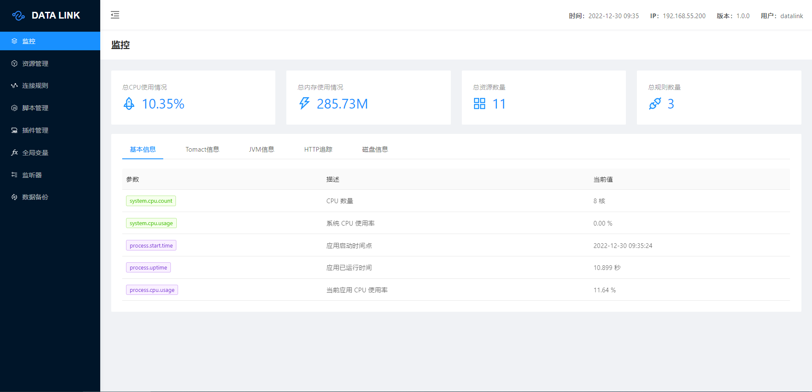

# DATA LINK

### 一、介绍
datalink是一个在各种异构数据源之间实现数据采集、桥接的工具，采用 Actor 模型开发。

目前支持的数据源有：

MQTT、Kafka、RabbitMQ、RocketMQ、Mysql、Postgresql、SQL Server、TDengine、TimescaleDB、MariaDB、Redis、TCP、UDP、HTTP、OPC UA、SNMP、Modbus TCP


支持无转换透传、JavaScript脚本、Java插件、SQL语句四种数据转换方式。

### 二、打包&安装

datalink是跨平台的，支持 Linux、Unix、macOS 以及 Windows，这意味着datalink可以部署在 x86_64 架构的服务器上。

#### 源码打包

```bash
git clone https://gitee.com/liyang9512/datalink.git
cd datalink
mvn -Prelease-datalink -Dmaven.test.skip=true clean install -U
```

#### 安装

使用源码打包或下载 datalink-server-$version.zip 或 datalink-server-$version.tar.gz 包

```bash
unzip datalink-server-$version.zip 或者 tar -xvf datalink-server-$version.tar.gz
cd datalink/bin
```

### 三、启动&停止

```bash
cd datalink/bin

#windows start
startup.cmd

#linux start
sh startup.sh

#windows shutdown
shutdown.cmd

#linux shutdown
sh shutdown.sh
```

### 四、Dashboard

程序启动后，使用浏览器访问 http://127.0.0.1:9966/ 即可打开管理页面，
默认用户名：datalink   密码：aaaaaa



### 五、配置文件

默认端口：9966

```bash
#*************** Spring Boot Related Configurations ***************#
### Default web context path:
server.servlet.contextPath=/
### Default web server port:
server.port=9966

#*************** Metrics Related Configurations ***************#
### Metrics for prometheus
management.endpoints.web.exposure.include=*
```