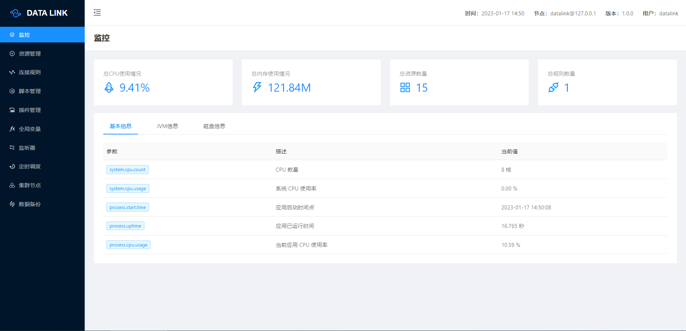

# DATA LINK
<a href='https://gitee.com/liyang9512/datalink/stargazers'></img></a>
<a href='https://gitee.com/liyang9512/datalink/members'></img></a>
### 一、介绍
datalink可以在各种异构数据源之间实现数据桥接，基于akka开发，支持最少两个节点的集群模式。


#### 支持数据源：
通讯协议：TCP、UDP、HTTP、OPC UA、SNMP、Modbus TCP \
消息通道：MQTT、Kafka、RabbitMQ、RocketMQ、ActiveMQ、Pulsar \
数据存储：Mysql、PostgreSQL、SQL Server、TDengine、TimescaleDB、MariaDB、Redis 

#### 支持数据处理方式：
JavaScript脚本、Java插件、SQL脚本、无处理透传


### 二、打包&安装

#### 源码打包

```bash
git clone https://gitee.com/liyang9512/datalink.git
cd datalink
mvn -Prelease-datalink -Dmaven.test.skip=true clean install -U
```

#### 安装

```bash
unzip datalink-server-version.zip 或者 tar -xvf datalink-server-version.tar.gz
cd datalink/bin
```

### 三、启动&停止

单节点模式：
```bash
cd datalink/bin

#windows start
startup.cmd

#linux start
sh startup.sh

#windows shutdown
shutdown.cmd

#linux shutdown
sh shutdown.sh
```

集群模式：（需在配置文件中配置节点列表）
```bash
cd datalink/bin

#windows start
startup.cmd -m cluster

#linux start
sh startup.sh -m cluster

#windows shutdown
shutdown.cmd

#linux shutdown
sh shutdown.sh
```

### 四、管理页面

程序启动后，使用浏览器访问 http://127.0.0.1:9966/ 即可打开管理页面 \
默认用户名：datalink   密码：aaaaaa



### 五、配置文件

主要配置说明：

```bash
### 用于访问管理页面的端口,默认9966
server.port=9966

### 集群模式下节点列表配置,形式为 IP:端口,IP:端口,IP:端口
### 第一组IP端口必须为本节点的IP端口
datalink.cluster.member.list=
```

## 六、使用文档
详见
[wiki](https://gitee.com/liyang9512/datalink/wikis)

## 七、开源许可

Apache License 2.0, 详见 [LICENSE](./LICENSE)。